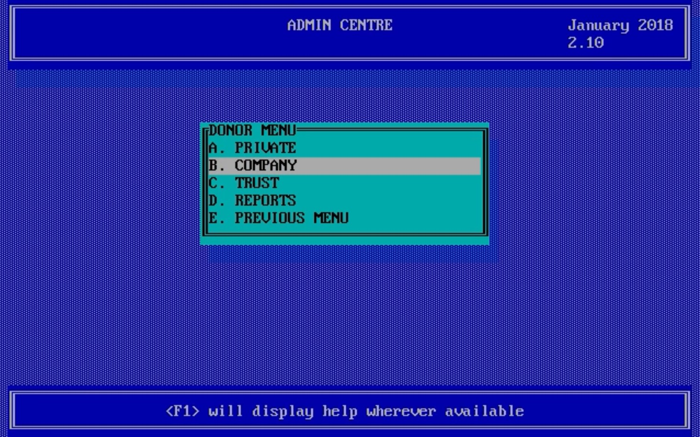

# Oasis Admin System for Donor Management

# Background
Donors System that I wrote in DOS-based Clipper 5.3 back in 1993/4 for a charity. The system kept track of donations and memmbership fees, as well as drawing reports and doing mailmerge to print labels to address envelopes for donation requests and membershhip renewals.

The system could recreate its indexes, create the databases if they did not yet exist, do backups, transfer data from the various centres to the mail centre by floppy disc. Variables like the VAT rate and mambership fees could be adjusted within the system.

# Compiling
I used Blinker to do the compiling. It used Extend and Super Lib 3.0 as additional libraries. Oamain.prg is the main file.

# Versions
* Version 1.00 BETA Started 1993-06-06  - Installed 1993-06-30
* Version 1.01 1993-07-05 Menu's improved, Reports expanded
* Version 1.02 1993-08-19 Fields added for Donors -> volunteer, club 600, fax, Correspondence -> cash amount.  Reports also work on these new fields.  Fixed bug that crashed when exiting correspondence. Date format is now dd/mm/yy.  Can also print all donors.
* Version 1.03 1993-08-22 Added emphasised printing and condensed printing.
* Version 2.00 1993-09-22 Includes members data, improved browse titles printouts to screen, mailmerge in postal code order, queries added for donors and donations.
* Version 2.01 1993-10-27 Generates installation discs, correspondence has 2 new fields C_Type and C_Receipt, caps lock switches off, prints out receipt for money received from corresp, saves deleted members, if run from floppy tries to install to C:\DONORS, also prints to labels now, fixed fault not copying PCKCENTR onto installation disc.
* Version 2.02 1994-01-30 Added DR & MRS and REV & MRS titles, prints surnames in capitals now, EMS support now enabled in linking, new oBrowse:forceStabilize Clipper 5.2 function used in browse, warns when backup is due, displays runtime info.
* Version 2.03 94-02-01 Added extra field to memeber's database to allow mem to be linked to a particular centre (only admin centre can book for other centres, other centres default to their own centre). Help for members' entry screens updated, moves members to a different type, eg from private to company.
* Version 2.04 94-08-08 Automatically detects old databases and updates length of Title field to 35 characaters and Amount for donations to 10 including point and decimals. Included Date on Donation Query printout and lengthened Detail 1 & 2 printout fields. Changed index keys for dates to DTOS which orders dates correctly. Query prints out below the printout.
* Version 2.05 94-08-22 Corrects filter problem on reports for Donors on newsletters, etc.  It also defaults to Company column when entering the browse.  Minor help update.
* Version 2.06 94-09-26 Added new fields to members printout, Added subtotal to donations printout. Users can themselves setup labels.
* Version 2.07 95-03-07 Adds a logic field to MEMBERS.DBf for paid and allows global updating of paid field.  WordPerfect Mailmerge. Fixed bug that did not save subs.  Centered main title and added a line at the bottom about F1 key.  Updated help for WP option. Also added a Donation amount field to Members.  Prompts before overwriting code files during installation.
* Version 2.08 95-03-15 Allows empty saluation field if it is a company or trust.  You can move over pick list fields using the arrow keys. You can now format a disc from the utility menu - to the highest capacity for the A drive only.  Option on Utils menu to calculate the actual subs based on the total required for members.
* Version 2.09 95-03-25 Allows total paid for members up to R9999.  Allows sub including VAT now.
* Version 2.10 95-09-27 Recomplied using Blinker 3.01 linker
* Version 2.11 99-11-17 Checked Y2K compliancy. Recompiled with new contact details.

# Demo Video
I actually ran the compiled DOS EXE under Linux later on and receorded this video that shows what the system looked like in action.

